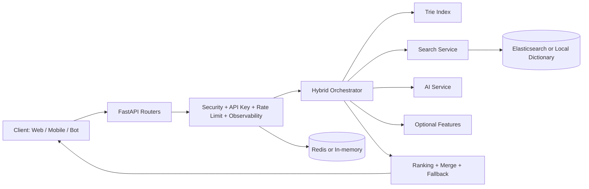

# TextHelper Ultimate

[](https://python.org)
[](https://fastapi.tiangolo.com)
[](https://www.docker.com/)
[](https://github.com/)

Turkce metin tamamlama ve oneri motoru: hizli prefix arama (Trie), sozluk/fuzzy arama (Elasticsearch veya local), ve opsiyonel transformer destekli hibrit bir FastAPI servisi.

Bu README, dogrudan kod tabanindaki mevcut yapiya gore hazirlandi; abartili benchmark veya kanitlanmamis iddia icermez.

---

## Neler Sunuyor?

- **Hybrid prediction pipeline:** `trie + dictionary + optional elasticsearch + optional transformer`.
- **Realtime API + WebSocket:** hem HTTP endpointleri hem anlik oneri akisi.
- **Fail-safe fallback:** Elasticsearch/Redis/model yoksa local sozluk ve in-memory akisla devam eder.
- **Moduler feature mimarisi:** `app/features` altinda ac-kapa calisabilen moduller.
- **Ogrenebilir sistem:** `/learn` endpointi ve batch scriptleri ile domain sozlugu guclendirilebilir.
- **Uretime uygun kosum:** Docker Compose, K8s ornekleri ve CI testi mevcut.

---

## Mimari Genel Bakis



### Katmanlar

- **API Katmani (`python_backend/app/routers`)**
  - `prediction.py`: `/predict`, `/process`, `/correct`, `/autocorrect/undo`
  - `learning.py`: `/learn`
  - `system.py`: `/health`, `/metrics`, `/index_words`
  - `websocket.py`: `/ws`
- **Orkestrasyon (`python_backend/app/services/orchestrator.py`)**
  - Paralel task calistirma, timeout katmanlari, normalize/merge/rank, garanti fallback.
- **Servisler (`python_backend/app/services`)**
  - `ai.py`, `search.py` gibi cekirdek servisler.
- **Feature Modulleri (`python_backend/app/features`)**
  - Trie, context completion, n-gram, ranking, emoji, domain dictionary vb.
- **Core Altyapi (`python_backend/app/core`)**
  - API key middleware, global rate limit, logging, telemetry, observability.

---

## Predict Akisi (Gercek Isleyis)

`POST /predict` cagrisi geldiginde akisin ozeti:

1. Router seviyesinde request validasyonu + local rate limit + input security kontrolu.
2. `HybridOrchestrator.predict(...)` calisir.
3. Kullanici bazli debounce (50ms) uygulanir.
4. Context tabanli hizli cevaplar denenir.
5. Paralel prediction taskleri tetiklenir:
   - Trie arama
   - Search (Elasticsearch varsa ES, yoksa local dictionary)
   - Large/medium dictionary
   - Opsiyonel AI, n-gram, phrase, domain, emoji, template
6. Sonuclar normalize edilir (dict/object farklari toparlanir), duplicate temizlenir, skorlanir.
7. Gerekirse relevance/ranking katmanlari uygulanir.
8. Bos sonuc durumunda fallback devreye girer (local dictionary garantisi).
9. `PredictionResponse` doner.

---

## Proje Yapisi

```text
TextHelper-main/
├─ python_backend/
│  ├─ app/
│  │  ├─ core/            # security, rate-limit, config, logs, telemetry
│  │  ├─ routers/         # HTTP + WS endpointleri
│  │  ├─ services/        # orchestrator, ai, search
│  │  ├─ features/        # trie, dictionary, context, ranking, vb.
│  │  └─ models/          # pydantic schema'lar
│  ├─ scripts/            # batch learn, frequency builder, setup
│  ├─ tests/              # pytest + load test
│  ├─ Dockerfile
│  └─ requirements.txt
├─ k8s/                   # backend deployment/service/config ornekleri
├─ docker-compose.yml
└─ BASLAT_ULTIMATE.bat
```

---

## API Ozeti

`main.py` router'lari hem prefixsiz hem de `/api/v1` altinda yayinlar (geriye donuk uyumluluk).

### Prediction

- `POST /predict`
- `POST /process` (legacy alias)
- `POST /correct`
- `POST /autocorrect/undo`

### Learning

- `POST /learn`

### System

- `GET /api/v1/health`
- `GET /api/v1/metrics`
- `POST /api/v1/index_words`

### WebSocket

- `WS /ws`
- `WS /api/v1/ws`

### Ornek Request

```json
{
  "text": "merhaba s",
  "context_message": "customer_support_chat_v1",
  "max_suggestions": 10,
  "use_ai": true,
  "use_search": true,
  "user_id": "demo-user"
}
```

### Ornek Response

```json
{
  "suggestions": [
    {
      "text": "size",
      "type": "dictionary",
      "score": 98.5,
      "description": "Sozluk onerisi",
      "source": "trie_index"
    }
  ],
  "corrected_text": null,
  "processing_time_ms": 12.4,
  "sources_used": ["trie_index", "local_dictionary"]
}
```

---

## Guvenlik ve Dayaniklilik

- **API Key Middleware:** `X-API-Key` header kontrolu; localhost/dev icin bypass kurallari mevcut.
- **CORS:** `ALLOWED_ORIGINS` env ayariyla yonetilir.
- **Rate Limit:**
  - Global middleware (`core/rate_limit.py`) Redis varsa Redis, yoksa memory.
  - Router/WS seviyesinde ek local limitler.
- **Input Validation:** SQL/XSS benzeri pattern kontrolleri (`features/security.py`).
- **Graceful Degradation:** dis servisler yoksa local fallback akisina iner.

---

## Hizli Baslangic

## 1) Lokal (Python)

```bash
cd python_backend
python -m venv .venv
.venv\Scripts\activate
pip install -r requirements.txt
uvicorn app.main:app --host 0.0.0.0 --port 8080 --reload
```

Tarayici:
- App: `http://localhost:8080`
- Swagger: `http://localhost:8080/docs`

## 2) Tek Komut Baslatma (Windows)

Kok dizinde:

```bat
BASLAT_ULTIMATE.bat
```

Script, Docker aciksa `backend + elasticsearch + redis` servislerini kaldirir; degilse lite moda duser.

## 3) Docker Compose

Kok dizinde:

```bash
docker-compose up -d --build
```

Varsayilan servisler:
- `backend` : `8080`
- `elasticsearch` : `9200`
- `redis` : `6379`

---

## Ortam Degiskenleri

Temel degiskenler (`python_backend/app/core/config.py`):

- `ENV`: `dev | staging | prod`
- `LOG_LEVEL`: `INFO`, `DEBUG`, vb.
- `API_KEY`: API key middleware icin gizli anahtar
- `ALLOWED_ORIGINS`: CORS origin listesi (`*` veya virgulle ayri liste)
- `USE_TRANSFORMER`: transformer tahminini ac/kapat
- `USE_ELASTICSEARCH`: Elasticsearch kullanimini ac/kapat
- `ENABLE_HEAVY_FEATURES`: ek agir feature'lari ac/kapat
- `ELASTICSEARCH_HOST`: ES adresi (ornek: `http://localhost:9200`)
- `REDIS_HOST`, `REDIS_PORT`: Redis baglantisi

Not: Bircok feature bayrak kapali oldugunda sistem hafif modda calisir ve sozluk/trie agirlikli sonuclar uretir.

---

## Sozluk ve Ogrenme Pipeline'i

### Buyuk dictionary olusturma

```bash
cd python_backend
python -m app.features.generate_large_dictionary
```

### Batch ogrenme (metin dosyasindan)

```bash
cd python_backend
python -m scripts.batch_learn path/to/texts.txt --user-id my-domain
```

Her satir bir mesaj olacak sekilde `/api/v1/learn` endpointine feed eder.

### Corpus'tan frekans olusturma

```bash
cd python_backend
python -m scripts.build_frequencies path/to/corpus1.txt path/to/corpus2.txt
```

Bu komut `data/tr_frequencies.json` dosyasini olusturur/gunceller.

---

## Kubernetes (Ornek)

`k8s/` altindaki dosyalar backend dagitimi icin referans olarak bulunur:

- `backend-deployment.yaml`
- `backend-service.yaml`
- `configmap.yaml`
- `secret-example.yaml`

`backend-deployment.yaml` icinde readiness/liveness probe olarak `/api/v1/health` kullanilir.

---

## Test ve CI

- Unit/API testleri: `python_backend/tests/test_api.py`
- Yuk testi: `python_backend/tests/load_test.py` (Locust)
- CI: `.github/workflows/backend-ci.yml`
  - Python 3.11
  - `pip install -r requirements.txt`
  - `pytest`

Lokal test:

```bash
cd python_backend
pytest
```

---

## Teknoloji Yigini

| Katman | Teknoloji |
|---|---|
| Backend | FastAPI, Uvicorn |
| Modelleme | Pydantic |
| AI (opsiyonel) | Transformers, Torch |
| Arama | Elasticsearch (opsiyonel) + local dictionary |
| Cache / Rate limit | Redis (opsiyonel) + memory fallback |
| Paketler | symspellpy, zeyrek, requests, orjson |
| Dagitim | Docker Compose, Kubernetes (ornek) |

---

## Bilinen Notlar

- Performans degerleri ortama, feature flag'lere ve veri setine gore degisir.
- AI/ES/Redis olmayan ortamlarda sistem fallback modunda yine calisir.
- `API_KEY` degerini production ortaminda mutlaka degistirin.

---

## Lisans ve Katki

Proje sahibi ve lisans detaylari icin depo ayarlarinizi kullanin. Kurumsal katkilar icin PR + CI yesil kuralini uygulamaniz onerilir.
